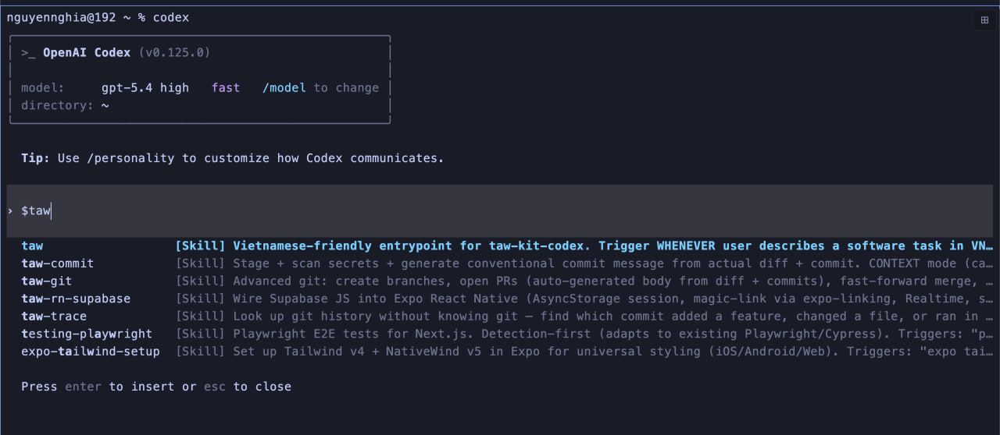

# taw-kit-codex

> Bộ kit **Codex CLI** cho người không biết code — ra mắt sản phẩm thật chỉ bằng một câu tiếng Việt.
>
> Bản port của [taw-kit](https://github.com/nghiahsgs/taw-kit) (vốn cho Claude Code) sang **OpenAI Codex CLI**.

```
> lam cho toi mot shop my pham online
  → hỏi lại cho rõ (3–5 câu)
  → lập kế hoạch 5 ý, bạn duyệt
  → code + test + review
  → deploy (Vercel, Docker, hoặc VPS)
  → trả về URL đã chạy
```

---

## Cách gọi `taw` trong Codex

Codex **không có** `/taw` slash command như Claude. Có 3 cách dùng:

### 1) Auto-trigger qua prose (khuyên dùng — đỡ gõ)

Cứ gõ thẳng việc muốn làm bằng tiếng Việt:

```
> lam cho toi mot shop ca phe
> them trang lien he
> loi roi, fix gium
> deploy len vercel
```

Codex tự match description → fire skill `taw`.

### 2) Explicit `$taw` (tương đương `/taw` của Claude — ngắn nhất)

Gõ `$taw` rồi space và nội dung. Codex sẽ pop autocomplete dropdown ngay khi gõ `$`:



Hiện ra hết các skill bắt đầu bằng `taw` (`taw`, `taw-commit`, `taw-git`, `taw-trace`, `taw-rn-supabase`...) + description. Bấm Enter chọn `taw` → tiếp tục gõ prose:

```
> $taw lam shop ca phe
> $taw deploy
> $taw status
> $taw kiem tra bao mat
```

> Skills cài user-scope (`~/.codex/skills/`) nên không cần namespace — gõ `$taw` thẳng, không phải `$taw-kit-codex:taw`.

### 3) Plain text mention (khi quên `$`)

```
> dung skill taw de lam shop ca phe
> use the taw skill to add a contact form
```

> ⚠️ `@` trong TUI là **file picker** (autocomplete file path), KHÔNG phải skill mention. Đừng gõ `@taw`, sẽ ra "no matches".

---

## Cheatsheet — tất cả việc `taw` làm được

Mỗi dòng có 2 cách viết: **prose** (auto-trigger, tự nhiên) và **explicit** (`$taw <subcmd>`, ép kit chạy).

### Tạo dự án / thêm tính năng

| Việc | Prose | Explicit |
|------|-------|----------|
| Tạo mới | `lam cho toi mot shop ca phe` | `$taw build shop ca phe` |
| Thêm tính năng | `them trang lien he` | `$taw add trang lien he` |
| Thêm form | `them form dat hang` | `$taw add form dat hang` |

### Sửa / debug

| Việc | Prose | Explicit |
|------|-------|----------|
| Auto-fix lỗi build | `loi roi, fix gium` | `$taw fix` |
| Debug bug khó | `bug khong tai hien duoc` | `$debug-flight-recorder` |

### Deploy

| Việc | Prose | Explicit |
|------|-------|----------|
| Vercel | `deploy len vercel` | `$taw deploy vercel` |
| Docker | `dockerize giup` | `$taw deploy docker` |
| VPS | `deploy len vps` | `$taw deploy vps` |
| Mobile (Expo) | `len app store` | `$taw deploy expo` |

### Maintain (bảo trì)

| Việc | Prose | Explicit |
|------|-------|----------|
| Test | `test cai login` | `$taw test login` |
| Upgrade deps | `nang cap next len 15` | `$taw upgrade next 15` |
| Dọn dead code | `don code dum` | `$taw clean` |
| Check perf | `cham qua, check perf` | `$taw perf` |
| Rollback | `lui lai ban hom qua` | `$taw rollback` |
| Refactor | `tach component nay` | `$taw refactor` |
| Sync types | `gen lai supabase types` | `$taw types` |
| Seed data | `seed du lieu vn` | `$taw seed` |
| Pre-push review | `tu review truoc khi push` | `$taw review` |
| Security audit | `kiem tra bao mat` | `$taw security` |
| Stack swap | `doi polar sang stripe` | `$taw stack-swap polar stripe` |
| Status dashboard | `xem tinh hinh du an` | `$taw status` |
| Memory (AGENTS.md) | `tao agents.md` | `$taw memory init` |

### Advisor (review opinionated)

| Việc | Prose | Explicit |
|------|-------|----------|
| Phân tích code | `phan tich kien truc` | `$taw analyze` |
| Gợi ý feature | `nen build gi tiep` | `$taw suggest` |
| Test coverage gap | `xem coverage` | `$taw coverage` |
| Adversarial / red team | `tim lo hong` | `$taw adversarial` |
| Scope check | `built dung yeu cau chua` | `$taw scope-check` |

### Git utilities (gọi trực tiếp skill, không qua `taw`)

| Việc | Explicit |
|------|----------|
| Commit thông minh | `$taw-commit` |
| Tạo branch / PR | `$taw-git branch <name>` / `$taw-git pr` |
| Tra git history | `$taw-trace ai sua cai nay` |

> **Mẹo:** Khi gõ `$` trong Codex TUI, nó pop autocomplete dropdown — chọn skill bằng arrow keys + Enter, không cần nhớ tên chính xác.

---

## Bạn nhận được gì

- **~40 skills, 6 agent-roles, 3 hooks** — đóng gói thành 1 Codex plugin (`taw`)
- **1 entrypoint duy nhất `$taw`** — router 2 tầng tự hiểu tạo mới / thêm / sửa / deploy / test / nâng cấp / dọn code / rollback / refactor / audit
- **Stack adaptation** — mặc định Next.js + Supabase + Polar, nhưng tự detect project hiện tại đang dùng Stripe/Drizzle/Clerk... và respect, không ghi đè
- **Tự maintain AGENTS.md** — kit cập nhật file memory cho Codex sau mỗi run. Tiết kiệm token + accurate hơn cho repo lớn
- **Design có gu** — bundle skill `frontend-design` (Anthropic, Apache 2.0) tránh "AI slop"
- **Dev workflow skills** — testing (vitest/playwright/rls), CI (GitHub Actions), bundle analyzer, knip, dep upgrade an toàn, Stripe alt, Sentry, taw-commit, taw-git, debug-flight-recorder, status dashboard
- **License Apache-2.0** — dùng + phân phối tự do, kể cả thương mại

---

## Cài đặt

### Yêu cầu

| Thứ | Để làm gì | Cài ở đâu |
|-----|-----------|-----------|
| **Codex CLI** | Runtime AI để chạy skill | [github.com/openai/codex](https://github.com/openai/codex) |
| **Node.js ≥ 20** | Project taw-kit tạo ra chạy trên đây | [nodejs.org](https://nodejs.org) |
| **git** | Clone repo | `brew install git` / `apt install git` |
| **OpenAI API key** hoặc **ChatGPT Plus** | Codex CLI gọi model | [platform.openai.com](https://platform.openai.com) |

**OS:** macOS, Linux, hoặc Windows qua WSL2.

### Cài

```bash
git clone https://github.com/the-agents-work/taw-kit-codex.git ~/.taw-kit-codex
bash ~/.taw-kit-codex/scripts/install.sh
```

Installer sẽ:
1. Phát hiện Codex CLI (báo lỗi nếu chưa cài).
2. Copy 46 skills vào `~/.codex/skills/<name>/` (Codex auto-discover từ đây).
3. Replace bản skill cũ do taw-kit quản lý. Nếu gặp skill cùng tên không có marker taw-kit, installer sẽ cảnh báo trước khi xoá.
4. Đăng ký marketplace qua `codex plugin marketplace add`.

> Mặc định **copy** (cross-platform). Dev contributor muốn live-edit: `TAW_SYMLINK=1 bash scripts/install.sh`.

### Update

```bash
cd ~/.taw-kit-codex && git pull && bash scripts/install.sh
```

### Verify

```bash
ls ~/.codex/skills | head     # phải thấy taw, agent-*, các skill khác
codex                          # mở TUI
> $taw                         # gõ $ → autocomplete dropdown hiện skill list
```

---

## Chạy lần đầu

```bash
mkdir my-first-product && cd my-first-product
codex
```

Trong Codex TUI:
```
> lam cho toi 1 landing page ban khoa hoc online
```

Codex auto-trigger skill `taw`, hỏi 3–5 câu clarify, hiện kế hoạch, đợi duyệt. Gõ `yes` → chạy: plan → research → code → test → security review → deploy. Tổng ~15-20 phút.

---

## Khác biệt so với bản Claude Code

| Tính năng | taw-kit (Claude) | taw-kit-codex |
|-----------|------------------|---------------|
| Gọi rõ ràng | `/taw <prose>` | `$taw <prose>` (Codex không có custom slash, `@` chỉ là file picker) |
| Auto-trigger qua prose | Có | Có (cùng cơ chế description match) |
| Subagent chạy song song | 2 researcher song song | Tuần tự (chậm hơn ~30s) |
| Skills format | `name` + `description` frontmatter | Giống nhau |
| Hooks (PreToolUse / PostToolUse / SessionStart...) | Có | Có (cùng JSON shape) |
| Sandbox / approval modes | plan / acceptEdits / bypassPermissions | `--sandbox` workspace-write / read-only / danger-full-access |
| Memory file | `CLAUDE.md` | `AGENTS.md` |

---

## Đóng góp

- **Repo:** [github.com/the-agents-work/taw-kit-codex](https://github.com/the-agents-work/taw-kit-codex)
- **Bản gốc Claude Code:** [github.com/nghiahsgs/taw-kit](https://github.com/nghiahsgs/taw-kit)
- **License:** Apache-2.0 (xem [LICENSE](./LICENSE))

Built by [the-agents-work](https://www.theagents.work/).
