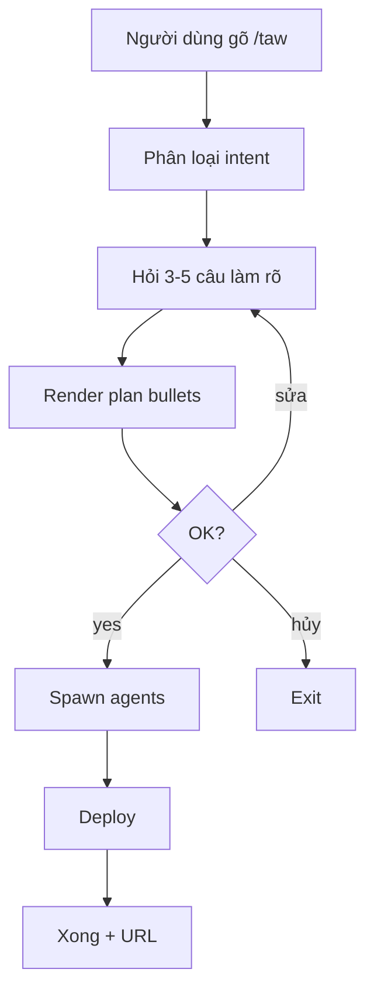
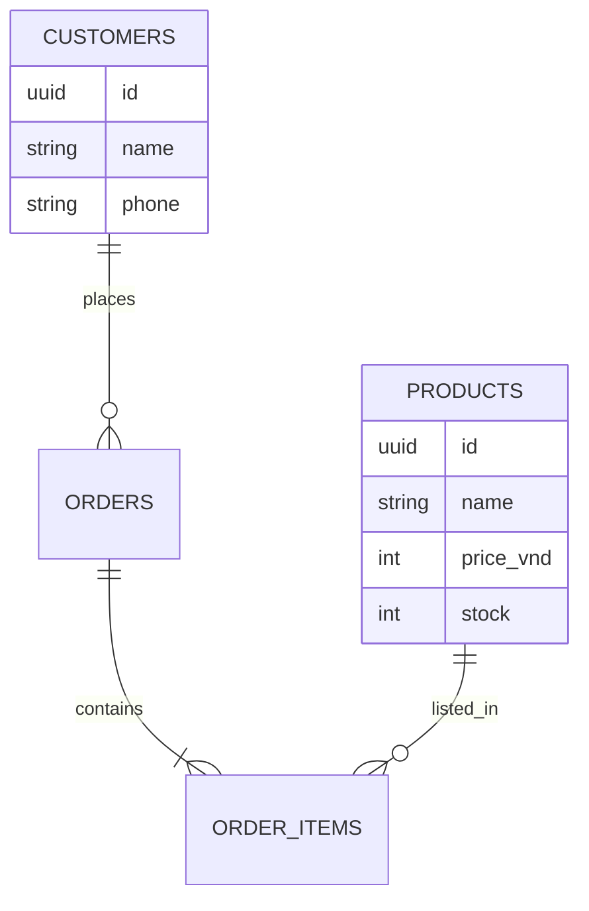

# mermaidjs-v11

Produce a Mermaid v11 diagram string. The renderer (markdown-novel-viewer, GitHub, Obsidian) handles visualization.

## When to invoke

- Plan phase file benefits from a flow diagram (≥ 3 interacting steps)
- User asks "vẽ cho tôi sơ đồ" or "architecture diagram"
- Orchestrator needs to show data flow for `/taw-add` (how a new feature wires into existing code)

## Supported diagram types

- `flowchart` — most common; use for orchestration steps, request flow
- `sequenceDiagram` — when showing actors (user, browser, API, DB)
- `erDiagram` — DB schema visualization for shop / CRM intents
- `journey` — user journey for landing page onboarding
- `gantt` — only if a phase file spans > 3 days (rare for taw-kit MVPs)

## Output contract

- Start with ` ```mermaid ` fence, end with ` ``` `
- First line declares type (e.g. `flowchart TD`)
- Node IDs are short ASCII (`A`, `B`, `U1`) — never Vietnamese diacritics (Mermaid parser trips)
- Node LABELS can be Vietnamese (quoted with `"..."`)
- Max 15 nodes per diagram; split into multiple if larger

## Example (flowchart)



## Example (erDiagram for shop)



## Anti-patterns

- Don't draw diagrams with fewer than 3 nodes; use prose instead
- Don't put large code blocks inside node labels (use an edge label or external note)
- Don't nest subgraphs more than 1 level deep — loses readability fast
